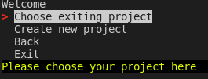
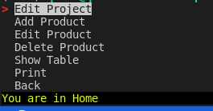
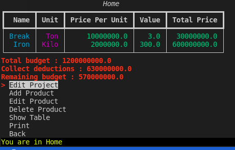
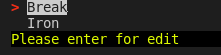

# Python Terminal base software

Add projects, add products, edit or delete them, print in table in terminal and save results in pdf file.

Data saved in sqlite database.

## Installation
```bash
python3 -m venv ./venv
```
```bash
source ./vevn/bin/activate
```
```bash
pip install -r requirements.txt
```
```bash
python3 main.py
```

## Some screenshot:
### --- Home menu


### --- Project menu


### --- Show in table


### --- Edit menu
